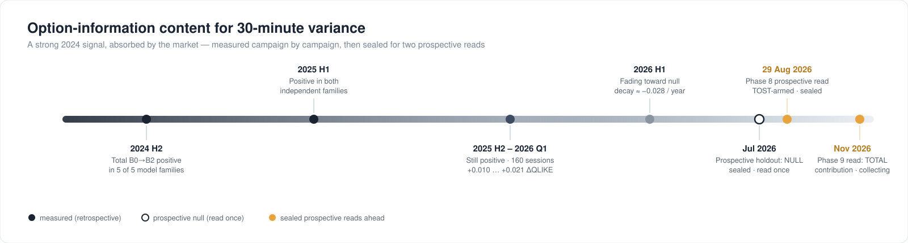
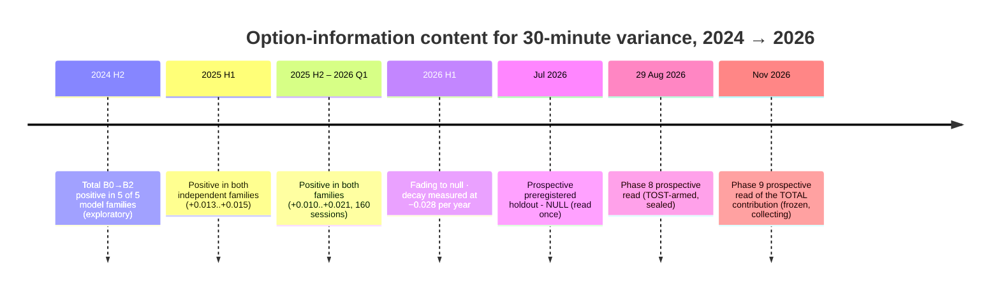
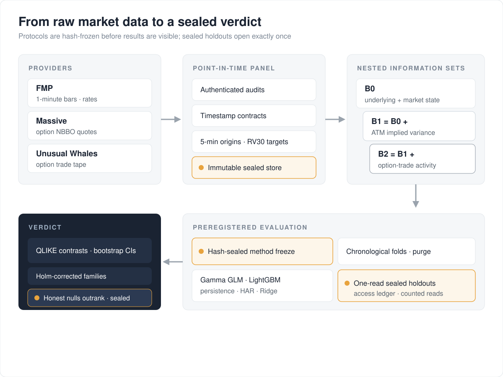
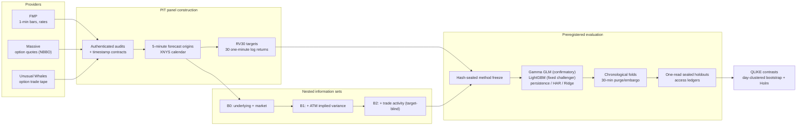

# MDS650 — Point-in-Time Options Activity for RV30 Forecasting

[](../../actions/workflows/ci.yml)


Does what just happened in the options market help predict how much a stock will move
over the next 30 minutes?

This repository holds the full research pipeline for my MDS650 capstone. It builds a
point-in-time (PIT) panel from three commercial market-data providers, constructs nested
information sets, and tests — under preregistered, one-read evaluation gates — whether
conventional option prices (B1) and recent option-trade activity (B2) add out-of-sample
predictive value for 30-minute realized variance (RV30) beyond what the stock and the
broad market already reveal (B0).

## The question, in plain terms

At every five-minute mark of the New York trading session, freeze everything a forecaster
could legitimately have known at that moment, then predict the realized variance of the
next 30 one-minute returns. Compare three nested views of the world on identical origins:

| Set | What it knows |
|-----|---------------|
| **B0** | Underlying price/volume history and market-wide state |
| **B1** | B0 + conventional option state (ATM implied variance level and changes) |
| **B2** | B1 + point-in-time option-trade activity (what was just traded, target-blind) |

If B2 beats B1 on data neither model has seen, recent option flow carries real
information. If it doesn't, that is worth knowing too — a preregistered null is a valid
result here, and the pipeline is built so that a null cannot be quietly tuned away.

> [!IMPORTANT]
> Every protocol in this repository was **frozen with a cryptographic hash before its
> results were seen**, sealed holdouts are read **exactly once** under access-ledger
> control, and every number below traces to a hashed artifact. Honest nulls outrank
> flattering retrospectives by binding rule (decision 53).

### The story in one picture



<details>
<summary>Timeline source (mermaid)</summary>



</details>

## How to read this repository (no specialist background needed)

1. **The question and the answer in plain words** — this page, top to bottom.
2. **The whole story in one document** —
   [`reports/gate_cascade_report_20260817.md`](reports/gate_cascade_report_20260817.md):
   what was tested, how, and what each test found, in reading order.
3. **The thesis itself** —
   [`reports/final_report_draft_v2.md`](reports/final_report_draft_v2.md).
4. **The defense slides and prepared Q&A** —
   [`reports/defense_deck_v2.md`](reports/defense_deck_v2.md).
5. **Deep evidence, when you want proof of any number** — every document in
   [`docs/INDEX.md`](docs/INDEX.md) and every result file under `artifacts/` carries a
   SHA-256 hash so it cannot be silently altered.

**Eight terms cover almost everything:**

| Term | Plain meaning |
|---|---|
| RV30 | How much a stock actually moved over the next 30 minutes (the thing we predict) |
| B0 / B1 / B2 | Three levels of knowledge: stock data only / + option prices / + option trades |
| PIT (point-in-time) | Only using information that truly existed at the moment of each forecast |
| QLIKE | The score used to judge forecasts (lower is better; differences are what matter) |
| Prospective vs retrospective | Tested on data sealed *before* anyone saw it, vs tested on the past |
| Frozen | Locked with a cryptographic hash before results were seen — cannot be tuned after |
| MDE | The smallest effect size the study promised to care about |
| Holm | A correction so that testing many things doesn't manufacture false positives |

## Findings at a glance (RP2-v3, 2026-08-21)

Measured on `rp2-v3-20260821-134741`, published to Supabase and readable through
`api.current_rp2_contrasts`. Development 389 sessions, validation 80. A positive delta is an
improvement in QLIKE: the smaller information set's loss minus the larger one's.

| Family | ΔB1 (D) | ΔB2\|B1 (D) | ΔB1 (V) | ΔB2\|B1 (V) |
| --- | ---: | ---: | ---: | ---: |
| `gamma_glm` | +0.00408 | −0.02549 | −0.00111 | −0.00222 |
| `ridge_log` | +0.00424 | −0.15509 | −0.00084 | −0.00195 |
| `lightgbm_qlike` | +0.00381 | +0.00065 | +0.00092 | −0.00051 |

1. **Contemporaneous option state helps in development, in two of three families.** ΔB1 is
   positive in all three, +0.0038 to +0.0042, with 95 % intervals excluding zero. Against the
   minimum this design could detect, the three differ: `gamma_glm` 1.66×, `ridge_log` 1.75×,
   and `lightgbm_qlike` **0.93× — below its own threshold**. So two families report an effect
   their design could resolve and the third reports one it could not, which is a weaker
   statement than "consistently" and the one the numbers support.

2. **It does not survive out of sample where the design could test it.** `ridge_log`'s
   validation MDE is 0.0027 against a development effect of 0.0042 — powered to see it, and
   it measured −0.00084. `gamma_glm` lands one session short of its own requirement (33
   needed, 32 available) and decides nothing. `lightgbm_qlike` would need roughly 692
   validation sessions to test its own effect and has 32, so its interval
   [−0.0108, +0.0129] cannot support any conclusion.

3. **Point-in-time flow adds nothing over option state.** ΔB2\|B1 is negative or
   indistinguishable from zero everywhere, and in `ridge_log` it is −0.155 with an interval
   spanning [−0.455, +0.001] — instability rather than signal.

4. **Ten of the twelve contrasts sit below their own minimum detectable effect.** Reporting
   those as nulls without saying so would claim more than the design can support. The full
   family-by-family power reading is in
   [`docs/rp2_v3/VERDICT.md`](docs/rp2_v3/VERDICT.md).

The section 21 gate returns **Result C**, on the narrower reading above rather than the
broader "B1 does not contribute" that the plan's wording invites.

### What this replaces

An earlier version of this section reported the B2-over-B1 increment under the Gamma GLM as
positive and statistically supported, up to +0.053. The rebuilt contrast is **−0.02549** in
development and **−0.00222** in validation, the latter with an interval excluding zero. The
sign is reversed, not the magnitude reduced. Six corrections account for it — a baseline
built from the square root of its own target, an option snapshot ending 1 920 s before the
origin, economics measured on the provider's clock, imputation using rows that were later
scored, a missing diagnostic dropping origins from the baseline too, and a cross-family race
that confounded estimator with information set. Five of the six leaked information toward the
predictor, and all pushed the same way.
[`SUPERSEDED_RESULTS.md`](docs/rp2_v3/SUPERSEDED_RESULTS.md) records each one.

### What a much richer option representation changed (2026-08-19)

Points 1–4 above were established with a compressed option representation: B1 was a single
at-the-money implied variance, B2 was nine counts in five-minute windows. A natural objection
is that the null simply reflects that compression. That objection has now been tested
directly, and the answer is on the record.

**B1 and B2 were rebuilt from the raw tape.** Every option trade carries the prevailing NBBO
and an implied volatility, so a full surface could be reconstructed at each origin without
buying new data: a median of **724 contracts, 22 expiries and 111 strikes per snapshot**,
against one number before. It reproduces put skew, smile convexity, a negative 25-delta risk
reversal, and an implied variance that sits above trailing realised variance — none of them
imposed. **How much of that surface is an artefact of what happened to trade has been measured,
not assumed**: rebuilding it at 36 origins from the *listed* chain, quoted contract by contract
from an independent feed, shows that trade selection understates put skew by 46 % and leaves the
at-the-money level essentially unbiased (decision 77). The level is what every later block
consumes; the skew features carry the correction. That last quantity is **not** a variance risk premium and is no longer named as one: a
premium is the gap between the risk-neutral and the physical expectation of *future* variance,
and substituting the trailing realisation makes the number a property of the recent past.

B2 became a **microstructure panel** — Greeks-weighted signed flow, an exponential-decay
arrival intensity, normalised concentration and entropy, trade-to-quote impact, provider
latency, and the multi-leg share — over the full origin panel with zero failures. The intensity
measure was previously called a Hawkes intensity; its parameters were fixed inputs, nothing was
estimated, and there is no branching ratio or stability condition behind it, so the name
asserted a model that does not exist.

5. **Recent option flow carries information the price history and the option surface cannot
   reconstruct — in one sample.** Under double machine learning, orthogonalising B2 against
   B0+B1 and clustering by session, the joint null is rejected in discovery at
   **p = 3 × 10⁻⁴⁶** (383 sessions). Traded premium, strike concentration, the
   arrival-intensity innovation and delta flow all carry it; vega- and gamma-weighted flow are
   null.

   **It survives a control that could have killed it.** Every B2 increment in this project was
   previously measured against a baseline that could not see the market: the SPY and QQQ
   columns were built into the panel and never registered as features, so B0 was blind to the
   index (decision 75). A model blind to the index attributes common movement to whatever it
   can see. Those bars were acquired for all 469 sessions, the columns registered, and the
   programme rebuilt — the discovery statistic **rose** from 206.8 to 241.7. The signal is not
   market beta.

   **In the second sample the same test returns p = 0.059** (80 sessions) and only the trade
   count keeps its sign at conventional significance. Both samples are exploratory — the second
   was consulted while choosing specifications, model families and targets, and each choice fed
   back into what is reported (decision 67) — so this is one exploratory result that does not
   reproduce in another, not a replication.
6. **That information is smaller than the cost of estimating the parameters needed to use
   it.** The out-of-sample QLIKE change is frequently negative even where the in-sample
   evidence is strong. Across six model families, four contrasts and an interaction term,
   every estimand is null or family-dependent. Hansen's SPA picks a best candidate at
   p = 0.0070, above the project's own sequential budget of 0.00417; White's Reality Check
   rejects nothing.

   The Clark–West figures that previously appeared here have been **withdrawn** (decision 68).
   The adjustment is derived for a linear model whose restricted form is a parameter
   restriction of the unrestricted one. A boosted tree on a larger feature set is a different
   function class, not a nested restriction, so the correction had no derivation there. It is
   now applied only to the two linear families and refuses to run elsewhere.
7. **No economic value — and now measured on a contract rather than an abstraction.** The
   earlier answer used a variance-carry proxy that traded in 100 % of periods and reported a
   Sharpe near +77; it never bought a contract. Replacing it with the instrument — one option
   per origin chosen point-in-time, entered at the ask, exited at the bid, delta-hedged at the
   entry delta, with fees and slippage and a capped book — gives a net Sharpe of **−24 in
   discovery and −39 in validation**, with execution cost at **71 % and 148 % of gross P&L**
   and every deflated Sharpe probability at 0.000. Adding B1 and B2 makes it marginally worse
   (decision 78, `docs/rp2/block11b_forward_economics_v1.md`).

   The mechanism is real, survives a market control, and does not survive a bid and an ask.
8. **A confirmatory prospective test of this effect is not currently feasible.** Sized on the
   measured session-level dispersion, the largest effect observed here needs a sample far
   beyond the 60–120 sessions under discussion. Running the smaller design would return a null
   whether or not the effect is real, so the protocol is frozen and deliberately not launched.

   The specific session counts previously quoted here have been **withdrawn** (decision 69).
   They were obtained by rescaling the largest |t| out of a family of searched targets — the
   maximum of many noisy statistics is biased upward by construction, so that number is the
   winner's curse expressed as an effect size, and it grows *more* optimistic the more targets
   were searched. Power is now simulated end to end from a design frozen in advance, over
   resampled blocks of whole sessions, with the effect shrunk for selection and the rejection
   rate under the null reported alongside it (`src/mds650/rp2/power.py`). Where no simulated
   sample size reaches the target, the answer is "no size in the range tested", not an
   extrapolation.

The full cascade — eighteen blocks, each with its advance rule and its verdict — has one
document per block under [`docs/rp2/`](docs/rp2/), starting from
[`docs/rp2/FINAL_REPORT.md`](docs/rp2/FINAL_REPORT.md).

The cross-campaign reconciliation — every contrast, every model, every protocol freeze
date — lives in [`docs/results_reconciliation_v2.md`](docs/results_reconciliation_v2.md).
The claim rules that every deliverable must follow are decision 53 in
[`docs/methodology_decisions.md`](docs/methodology_decisions.md).

## How the pipeline works



<details>
<summary>Pipeline source (mermaid)</summary>



</details>

Every result flows through the same discipline: the protocol is frozen and hashed before
outcomes are visible, sealed holdouts are opened exactly once under an access ledger, and
negative results stay in the record with the same weight as positive ones.

## Where things live

```
src/mds650/          Typed library (mypy --strict): providers, PIT panel, targets,
                     features, models, inference, calibration, HAR/HARQ, evaluation
scripts/             Phase runners, gate runners, acquisition, automation
                     -> classified in scripts/README.md (active / frozen-evidence /
                        one-shot-done / archive)
tests/               1,346 tests: unit, contract (artifact/freeze locks), e2e
specs/001-.../       Spec Kit: requirements, plan, tasks, JSON-schema contracts
docs/                Methodology decisions (binding, numbered), risk register,
                     results reconciliation, gate reports, PIT contracts
                     -> every doc classified in docs/INDEX.md
artifacts/           Committed governance evidence: preregistrations, manifests,
                     hashes, results JSONs, access ledgers (immutable)
reports/             Final report, defense deck, gate-cascade report,
                     canonical validation package, proposal
```

> [!NOTE]
> Licensed commercial data cannot be redistributed. The 15 granular derived datasets
> (~133 MB) live in **gated private storage**: their SHA-256 pointers are committed in
> [`data/GATED_DATA_POINTERS.json`](data/GATED_DATA_POINTERS.json) and access is
> granted per request — see [`data/DATA_ACCESS.md`](data/DATA_ACCESS.md). Everything
> else (all code, docs, aggregate results, sanitized fixtures) is fully public; full
> reproduction from scratch requires live provider entitlements.

Heavy commercial-derived evidence (raw provider payloads, large panels) is **not** in
git — see the next section.

## Getting started

Requirements: Python 3.12, [uv](https://docs.astral.sh/uv/), Windows or Linux.

```bash
uv sync --locked          # reproduce the exact environment from uv.lock
uv run pytest -q          # full suite; evidence tests skip without the mount below
uv run ruff check src scripts tests
uv run mypy src scripts
```

Two environment variables control access to non-versioned research evidence:

| Variable | Meaning |
|----------|---------|
| `MDS650_DATA_ROOT` | Root of bulk licensed data (default `D:\MDS650`) |
| `MDS650_EVIDENCE_ROOT` | Mount point of the byte-faithful evidence tree; when set, ~70 additional contract tests verify frozen artifact hashes against it |

Without the mounts the suite still runs — evidence-bound tests skip transparently with
an explicit reason rather than failing or silently passing.

## Data availability

The study uses licensed commercial data (FMP, Unusual Whales, Massive) that cannot be
redistributed. Reproducibility is handled at two levels, following the registered
controlled-auditability contract:

- **With equivalent licenses:** the frozen pipeline re-runs end to end from raw
  acquisition; every step is manifest- and hash-bound.
- **Without licenses:** code, JSON-schema contracts, sanitized fixtures, frozen session
  and asset registries, SHA-256 evidence indices, missingness reports, and aggregate
  results allow full audit of *process* without access to raw vendor rows.

Raw payloads, credentials, and bulk caches never enter git; the ignore rules and a
contract test enforce that no API key or bearer token appears in tracked files.

## Research governance

The repository treats process integrity as a first-class deliverable:

- **Numbered binding decisions** (75 so far) in `docs/methodology_decisions.md` — every
  methodological choice, window, and claim boundary is written down before it matters.
- **Risk register** (`docs/risk_register.md`, R-001…R-024) — including the uncomfortable
  ones: campaign-level multiplicity, confirmatory-model calibration pathology, and the
  two provider-timing assumptions that remain unproven.
- **Sealed cohorts** (Validation A/B, Phase 8 prospective holdout) — zero scientific
  reads; their disposition is an explicit owner decision
  (`docs/sealed_cohorts_disposition_v1.md`), and new retrospective campaigns are under
  moratorium until it is made.
- **Physically immutable evidence** — frozen artifacts are write-protected on disk and
  hash-verified in CI (decision 62), so a committed result cannot drift silently.

## Status

Active capstone research, single-author. The proposal draft is at
[`reports/proposal_draft_v2.md`](reports/proposal_draft_v2.md).

The eighteen-block research programme that rebuilt both option information sets from the raw
tape is complete; its finding is that recent option flow carries real but economically
negligible incremental information, and that no feasible prospective test could confirm it.
The next scientific step is an owner decision between completing the sealed prospective
holdout or closing it formally — the analysis code is ready either way — and, separately,
whether to fund a campaign large enough to test the effect or to publish the null as it
stands. The session count that figure once carried is withdrawn with the method that
produced it (decision 69); sizing a campaign now requires running the blocked simulation in
`src/mds650/rp2/power.py` against a design frozen in advance.

**Author:** Miguel Guerrero · MDS650 Capstone · 2026
