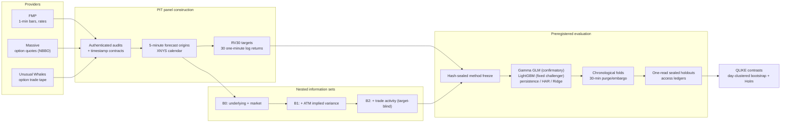

# MDS650 — Point-in-Time Options Activity for RV30 Forecasting

Does what just happened in the options market help predict how much a stock will move
over the next 30 minutes?

This repository holds the full research pipeline for my MDS650 capstone. It builds a
point-in-time (PIT) panel from three commercial market-data providers, constructs nested
information sets, and tests — under preregistered, one-read evaluation gates — whether
conventional option prices (B1) and recent option-trade activity (B2) add out-of-sample
predictive value for 30-minute realized variance (RV30) beyond what the stock and the
broad market already reveal (B0).

## The question, in plain terms

At every five-minute mark of the New York trading session, freeze everything a forecaster
could legitimately have known at that moment, then predict the realized variance of the
next 30 one-minute returns. Compare three nested views of the world on identical origins:

| Set | What it knows |
|-----|---------------|
| **B0** | Underlying price/volume history and market-wide state |
| **B1** | B0 + conventional option state (ATM implied variance level and changes) |
| **B2** | B1 + point-in-time option-trade activity (what was just traded, target-blind) |

If B2 beats B1 on data neither model has seen, recent option flow carries real
information. If it doesn't, that is worth knowing too — a preregistered null is a valid
result here, and the pipeline is built so that a null cannot be quietly tuned away.

## Findings at a glance (as of 2026-08-17)

Honest summary, in the order the evidence deserves:

1. **The only prospective, preregistered test returned null.** A 10-session holdout
   (July 2026), sealed before collection and read exactly once, confirmed neither the B1
   nor the B2 increment.
2. **Retrospective evaluations show a recurring, model-specific B2 signal.** Under the
   confirmatory Gamma GLM, the B2-over-B1 QLIKE improvement is positive and statistically
   supported in several historical blocks (up to +0.053, robust to the five registered
   timing sensitivities in the latest confirmation), **but the fixed LightGBM challenger
   reverses or nulls it in every one of those samples.** The binding label is
   `POSITIVE_BUT_NOT_GLOBALLY_CONFIRMED`.
3. **Conventional option state (B1) does not reliably beat B0** under the frozen
   campaign designs; the contrast flips sign across periods, assets, and model families.
4. **Exploratory, but model-robust: the *total* option-information contribution
   (B0→B2) is positive across families in most eras.** In the 2024 blocks it is
   significantly positive in 5/5 families, and a uniform three-family ladder over the
   frozen panels shows 3/3-family positive totals across 2025-03..2026-03 (229
   sessions, wild p ≤ 2e−4), concentrated in option state and fading toward null in
   2026 (`docs/positive_findings_v1.md`, decision 56). The family-dependence headline
   is partly a property of the frozen confirmatory design, not of option information
   itself.

The cross-campaign reconciliation — every contrast, every model, every protocol freeze
date — lives in [`docs/results_reconciliation_v2.md`](docs/results_reconciliation_v2.md).
The claim rules that every deliverable must follow are decision 53 in
[`docs/methodology_decisions.md`](docs/methodology_decisions.md).

## How the pipeline works



Every result flows through the same discipline: the protocol is frozen and hashed before
outcomes are visible, sealed holdouts are opened exactly once under an access ledger, and
negative results stay in the record with the same weight as positive ones.

## Where things live

```
src/mds650/          Typed library (mypy --strict): providers, PIT panel, targets,
                     features, models, evaluation, freeze/ledger machinery
scripts/             Phase runners, acquisition, freezes, audits (~70 scripts)
tests/               1,000+ tests: unit, contract (artifact/freeze locks), e2e
specs/001-.../       Spec Kit: requirements, plan, tasks, JSON-schema contracts
docs/                Methodology decisions (binding, numbered), risk register,
                     results reconciliation, PIT timing contracts, execution plans
artifacts/           Committed governance evidence: preregistrations, manifests,
                     hashes, results JSONs, access ledgers
reports/             Handoffs, literature packages, master dossier, proposal draft
```

Heavy commercial-derived evidence (raw provider payloads, large panels) is **not** in
git — see the next section.

## Getting started

Requirements: Python 3.12, [uv](https://docs.astral.sh/uv/), Windows or Linux.

```bash
uv sync --locked          # reproduce the exact environment from uv.lock
uv run pytest -q          # full suite; evidence tests skip without the mount below
uv run ruff check src scripts tests
uv run mypy src scripts
```

Two environment variables control access to non-versioned research evidence:

| Variable | Meaning |
|----------|---------|
| `MDS650_DATA_ROOT` | Root of bulk licensed data (default `D:\MDS650`) |
| `MDS650_EVIDENCE_ROOT` | Mount point of the byte-faithful evidence tree; when set, ~70 additional contract tests verify frozen artifact hashes against it |

Without the mounts the suite still runs — evidence-bound tests skip transparently with
an explicit reason rather than failing or silently passing.

## Data availability

The study uses licensed commercial data (FMP, Unusual Whales, Massive) that cannot be
redistributed. Reproducibility is handled at two levels, following the registered
controlled-auditability contract:

- **With equivalent licenses:** the frozen pipeline re-runs end to end from raw
  acquisition; every step is manifest- and hash-bound.
- **Without licenses:** code, JSON-schema contracts, sanitized fixtures, frozen session
  and asset registries, SHA-256 evidence indices, missingness reports, and aggregate
  results allow full audit of *process* without access to raw vendor rows.

Raw payloads, credentials, and bulk caches never enter git; the ignore rules and a
contract test enforce that no API key or bearer token appears in tracked files.

## Research governance

The repository treats process integrity as a first-class deliverable:

- **Numbered binding decisions** (53 so far) in `docs/methodology_decisions.md` — every
  methodological choice, window, and claim boundary is written down before it matters.
- **Risk register** (`docs/risk_register.md`, R-001…R-024) — including the uncomfortable
  ones: campaign-level multiplicity, confirmatory-model calibration pathology, and the
  two provider-timing assumptions that remain unproven.
- **Sealed cohorts** (Validation A/B, Phase 8 prospective holdout) — zero scientific
  reads; their disposition is an explicit owner decision
  (`docs/sealed_cohorts_disposition_v1.md`), and new retrospective campaigns are under
  moratorium until it is made.
- **Consolidation record** (`docs/consolidation_record_20260817.md`) — full audit trail
  of the 2026-08-17 repository consolidation, with off-machine backups.

## Status

Active capstone research, single-author, private. The proposal draft is at
[`reports/proposal_draft_v1.md`](reports/proposal_draft_v1.md); the next scientific step
is an owner decision between completing the sealed prospective holdout (Phase 8) or
closing it formally — the analysis code is ready either way.

**Author:** Miguel Guerrero · MDS650 Capstone · 2026
